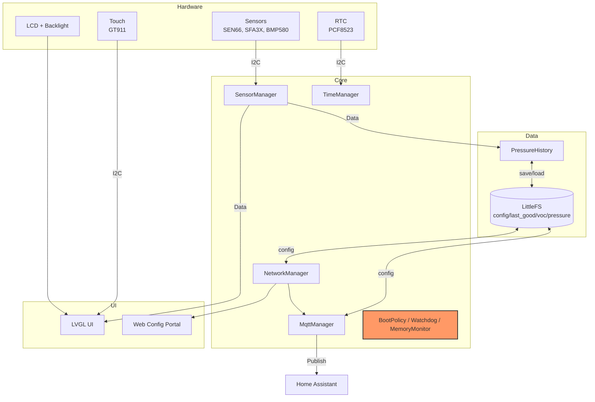

# Project Aura

<!-- TODO: Replace badges with the exact set you already shared -->
[](https://platformio.org/)
[](https://www.espressif.com/en/products/socs/esp32-s3)
[](https://lvgl.io/)
[](LICENSE)

Support this project: back the crowdfunding to get detailed build instructions and 3D-printable enclosure models at
https://makerworld.com/en/crowdfunding/159-project-aura-make-the-invisible-visible


Project Aura is an open-source ESP32-S3 air-quality station built for makers who want a polished,
reliable device rather than a bare sensor board. It combines a touch-friendly LVGL UI, a local web
setup portal, and MQTT with Home Assistant discovery, all wrapped in a 3D-printable enclosure.
This repository contains the firmware and configuration needed to flash and customize the device.

## What you get
- Firmware source code (GPL-3.0-or-later).
- A ready-to-build PlatformIO project for ESP32-S3.
- Access to enclosure models and a PDF build guide via the MakerWorld backer tier (not in this repository).
- A Commercial License option for businesses (see `COMMERCIAL_LICENSE_SUMMARY.md`).


## Gallery


## UI Screens


## Highlights
- Multi-sensor telemetry (temp, humidity, CO2, VOC, NOx, PM, pressure, HCHO).
- LVGL UI with night mode, custom themes, and status indicators.
- Wi-Fi AP onboarding + mDNS portal (`aura.local`) for Wi-Fi/MQTT/theme setup.
- MQTT state publishing and Home Assistant discovery + command topics.
- **Robust Safe Boot:** automatic rollback to last-known-good config after crashes, plus boot diagnostics and I2C recovery.

## Hardware
- Waveshare ESP32-S3-Touch-LCD-4.3 (16MB flash, LittleFS).
- RGB LCD + touch via ESP32_Display_Panel (GT911 supported).
- Sensor drivers included: SEN66, SFA3X, DPS310, BMP580, PCF8523 RTC.

## Pin Configuration (Wiring)
| Component | Pin (ESP32-S3) | Notes |
| :--- | :--- | :--- |
| **3V3** | `3V3` | Power for external I2C sensors |
| **GND** | `GND` | Common ground |
| **I2C SDA** | `GPIO 8` | SEN66, SFA3X, BMP580 (external) |
| **I2C SCL** | `GPIO 9` | |

Display and touch are on the board; no external wiring is needed.

## Firmware Architecture
Data flow and responsibilities are intentionally split into small managers:



Core modules live in `src/core/` and orchestrate startup (`AppInit`, `BoardInit`).
Feature managers are in `src/modules/`, UI in `src/ui/`, and web pages in `src/web/`.

## Build and Flash (PlatformIO)
Prereqs: PlatformIO CLI or VSCode + PlatformIO extension.
Built with Arduino ESP32 core 3.1.1 (ESP-IDF 5.3.x).

```powershell
pio run -e project_aura
pio run -e project_aura -t upload
pio device monitor -b 115200
```

## Configuration and Secrets
Runtime settings are stored on-device in LittleFS:
- `/config.json` (active config)
- `/config.last_good.json` (rollback snapshot)

Wi-Fi, MQTT, and themes can be configured from the device UI or from the web portal:
- AP mode SSID: `ProjectAura-Setup`
- Config portal: `http://192.168.4.1`
- When connected: `http://aura.local/` (Wi-Fi), `/mqtt`, `/theme`

Optional compile-time defaults belong in `include/secrets.h`, which is ignored by git.
Copy and edit:

```text
copy include/secrets.h.example include/secrets.h
```

This keeps Wi-Fi passwords and MQTT credentials out of the repository while still allowing
easy local setup.

## MQTT + Home Assistant
- State topic: `<base>/state`
- Availability topic: `<base>/status`
- Commands: `<base>/command/*` (night_mode, alert_blink, backlight, restart)
- Home Assistant discovery: `homeassistant/*/config`

MQTT stays idle until configured and enabled.


## License & Commercial Use
- Firmware in this repository is licensed under GPL-3.0-or-later (see `LICENSE`).
- Commercial use is allowed under GPL. If you distribute firmware (including in devices), you must provide the Corresponding Source under GPL.
- If you need to sell devices while keeping firmware modifications proprietary, obtain a Commercial License (see `COMMERCIAL_LICENSE_SUMMARY.md`).
- Enclosure models and the PDF build guide are not in this repository; they are available to backers on MakerWorld under separate terms.
- Trademark and branding use is covered by `TRADEMARKS.md`.

## Tests
See `TESTING.md` for native host tests and `scripts/run_tests.ps1`.

## Docs
- `CUSTOM_IPC_STACK_BUILD.md` covers custom ESP-IDF/Arduino IPC stack size builds.

## Repo Layout
- `src/core/` boot, init, reliability
- `src/modules/` sensors, storage, network, MQTT, time
- `src/ui/` LVGL screens, assets, controllers
- `src/web/` HTML templates and handlers
- `test/` native tests and mocks

